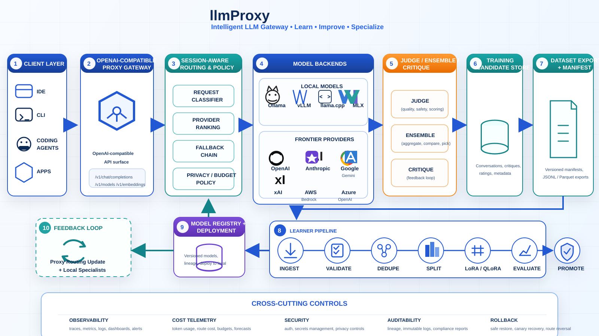

# llmProxy

This repository is currently in the specification phase for a SpecKit-aligned, spec-driven development project.

The primary implementation baseline is documented through the SpecKit-aligned core artifacts in [specs/001-llmproxy-foundation](./specs/001-llmproxy-foundation) and the extended reference library in [docs/specs](./docs/specs/README.md).

Initial source material is [baseline.txt](./baseline.txt).

Future coding agents should begin with the documents in `docs/specs/` before starting implementation.

## Architecture

## License

This repository is licensed under the Apache License, Version 2.0. See [LICENSE](./LICENSE).
